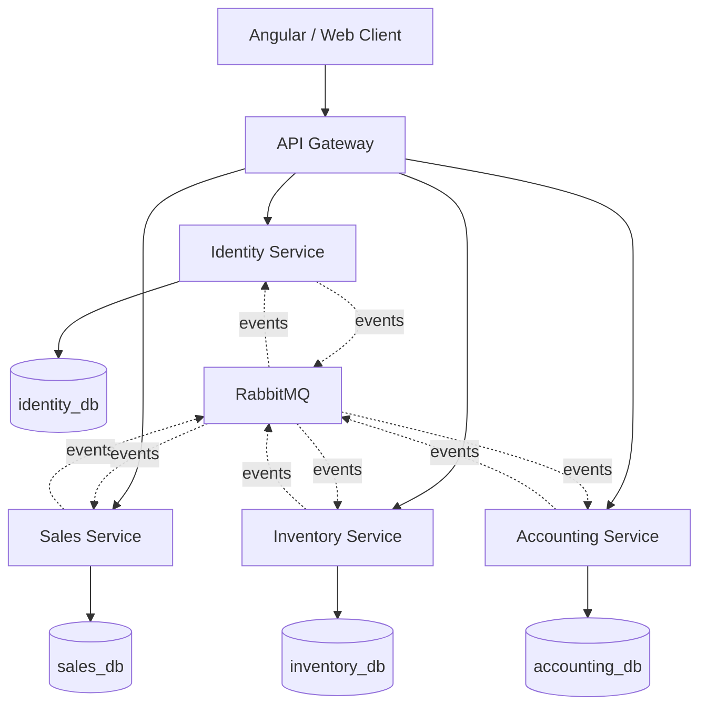

# ERP Backend

Enterprise ERP/SaaS backend foundation. This repository is a NestJS TypeScript monorepo with an API gateway and domain microservices. Business features are implemented incrementally; this first slice is a buildable architecture only.

## Overview

The platform will support multi-tenant companies, sales, inventory, accounting (including double-entry bookkeeping), RBAC, and later CRM, purchasing, production, and reporting. Accounting is a core domain: financial transactions will eventually post balanced journal entries. Domain services do not share databases.

## Architecture

```text
Angular/Web Client
        |
        v
   API Gateway
        |
   +----+----+---------+------------+
   |         |         |            |
   v         v         v            v
Identity   Sales    Inventory    Accounting
Service    Service   Service       Service
   |         |         |            |
   v         v         v            v
identity_db sales_db inventory_db accounting_db
```

Synchronous calls use REST. Business events use RabbitMQ. See `docs/architecture/` for details.



## Technology stack

| Area | Choice |
| --- | --- |
| Runtime | Node.js 22, TypeScript |
| Framework | NestJS 11 (REST) |
| ORM | Prisma 6 |
| Database | PostgreSQL 16 (database per service) |
| Messaging | RabbitMQ |
| API docs | OpenAPI / Swagger (gateway) |
| Auth (prepared) | JWT access + refresh, RBAC, policies |
| Observability | Pino structured logs, Terminus health checks |
| Tests | Jest |
| Local runtime | Docker and Docker Compose |

## Services

| Service | Port | Database | Responsibility (target) |
| --- | --- | --- | --- |
| API Gateway | 3000 | none | Edge: versioning, Swagger, rate limits, future JWT + proxy |
| Identity | 3001 | `identity_db` | Tenants, users, auth, RBAC, policies |
| Sales | 3002 | `sales_db` | Orders, invoices; emits financial events |
| Inventory | 3003 | `inventory_db` | Items, stock, warehouses |
| Accounting | 3004 | `accounting_db` | GL, journals, trial balance, P&L, balance sheet |

Future services (not created yet): CRM, Purchase, Production, Reporting, Notification, Meeting, Advanced MRP, Capacity Planning, Shop Floor.

Shared libraries:

- `@app/common` — bootstrap, env validation, health, logging, exception/response format, tenant request context
- `@app/messaging` — event names, payloads, RabbitMQ client registration

## Local setup

Prerequisites:

- Node.js 22
- npm 10+
- Docker Desktop (for Postgres, RabbitMQ, and full stack)

```bash
git clone <repository-url>
cd Nest_Backend
cp .env.example .env
npm install
npm run prisma:generate
```

Replace JWT secrets in `.env` before any non-local use.

## Docker setup

Start infrastructure only:

```bash
docker compose up -d postgres rabbitmq
```

Start the full stack (build images, generate Prisma clients, run services):

```bash
docker compose up --build
```

RabbitMQ management UI: `http://localhost:15672` (credentials from `.env`). Host AMQP uses `RABBITMQ_PORT` (default `25672`); containers use `rabbitmq:5672`.

## Environment variables

Copy `.env.example` to `.env`. Important variables:

| Variable | Used by | Purpose |
| --- | --- | --- |
| `NODE_ENV` | all | `development` \| `test` \| `production` |
| `SERVICE_NAME` | all | Log and health identity |
| `PORT` | API Gateway (shared `.env`) | Gateway HTTP port (`3000`). Identity does not use this value; it listens on `3001`. |
| `DATABASE_URL` | domain services | PostgreSQL connection for **that** service only |
| `RABBITMQ_URL` | all | AMQP URL |
| `RABBITMQ_QUEUE` | domain services | Service event queue |
| `JWT_ACCESS_SECRET` | gateway + services | Access-token signing (auth not implemented yet) |
| `JWT_REFRESH_SECRET` | gateway | Refresh-token signing |
| `IDENTITY_SERVICE_URL` | gateway | Downstream identity base URL |
| `SALES_SERVICE_URL` | gateway | Downstream sales base URL |
| `INVENTORY_SERVICE_URL` | gateway | Downstream inventory base URL |
| `ACCOUNTING_SERVICE_URL` | gateway | Downstream accounting base URL |
| `LOG_LEVEL` | all | Pino log level |
| `POSTGRES_*` / `RABBITMQ_*` | compose | Local infrastructure credentials. `POSTGRES_PORT` is the host publish port (default `15432`). |

Do not hard-code secrets. Do not commit `.env`.

When running a domain service on the host (`npm run start:identity`, Prisma CLI), `.env` `DATABASE_URL` must use `localhost` and `POSTGRES_PORT` (default `15432`). Docker Compose keeps using the internal hostname `postgres:5432` via per-service `environment` overrides, so you do not switch the same URL when moving between host and containers.

## Running the services

Infrastructure:

```bash
docker compose up -d postgres rabbitmq
```

Then in separate terminals from the repo root:

```bash
npm run start:gateway
npm run start:identity
npm run start:sales
npm run start:inventory
npm run start:accounting
```

`npm run start:identity` listens on **3001**, even when the shared `.env` has `PORT=3000` for the gateway. Docker Compose already sets `PORT: 3001` for the identity container.

Or run the compiled stack with `docker compose up --build`.

Health:

- Orchestrator: `GET http://localhost:3000/health`
- Versioned: `GET http://localhost:3000/api/v1/health`
- Same pattern on ports 3001–3004

## Database migration instructions

Each service owns its Prisma schema. Never point two services at the same database.

Generate clients:

```bash
npm run prisma:generate
```

Create/apply migrations (after domain models exist, or for the foundation `_schema_meta` table):

```bash
npm run prisma:migrate:identity
npm run prisma:migrate:sales
npm run prisma:migrate:inventory
npm run prisma:migrate:accounting
```

Production-style deploy:

```bash
npx prisma migrate deploy --schema=apps/identity-service/prisma/schema.prisma
```

Repeat for the other three schemas.

Development-only Identity seed (Demo tenant `DEMO` + `admin@demo.local`). Refuses to run when `NODE_ENV=production`. Password comes from `DEV_ADMIN_PASSWORD` (local default documented in `.env.example`):

```bash
npm run prisma:seed:identity
```

## Swagger / API documentation

Swagger UI is enabled on the API Gateway:

`http://localhost:3000/docs`

OpenAPI JSON: `http://localhost:3000/docs-json`

Domain APIs will be exposed through the gateway under `/api/v1/...`. Examples (not implemented yet):

- `POST /api/v1/auth/login`
- `GET /api/v1/users`
- `POST /api/v1/sales/orders`
- `GET /api/v1/inventory/items`

## Testing

```bash
npm test
npm run test:cov
npm run test:e2e
```

Unit tests compile each application module and cover shared contracts. Integration tests against Postgres will be added with domain features.

## Future roadmap

1. Identity: tenants, users, password hashing, JWT, refresh rotation, RBAC, policies, audit log
2. Gateway: JWT validation, tenant enforcement, authenticated proxy to services
3. Sales: customers (refs), orders, invoices; `sales.invoice.posted` events
4. Inventory: items, stock ledger, reservations
5. Accounting: chart of accounts, balanced journals, GL, trial balance, P&L, balance sheet
6. Later services: CRM, Purchase, Production, Reporting, Notification, Meeting, MRP, capacity, shop floor

## License

UNLICENSED — private project.
