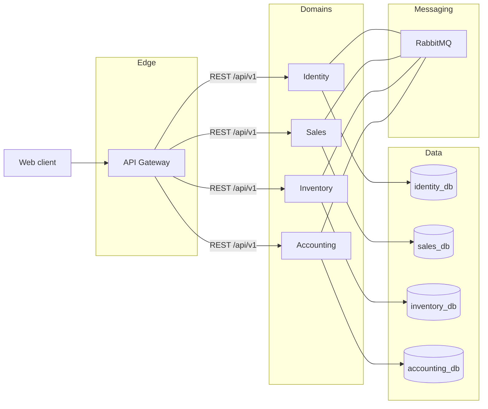

# Architecture overview

This backend is a NestJS monorepo of independently deployable services. The first release slice establishes the skeleton: HTTP bootstrap, configuration, health, logging, Prisma per service, Docker, and event contracts.

## Goals

- Isolate business domains so teams can evolve Sales, Inventory, Identity, and Accounting separately.
- Enforce **database-per-service**. Accounting never queries `sales_db`.
- Put a single public edge (API Gateway) in front of internal REST APIs.
- Use events for cross-domain facts (for example a posted sales invoice that must become a journal).
- Prepare SaaS multi-tenancy (`tenantId` on every future business record).
- Keep accounting as a first-class domain, even before the posting engine exists.

## Runtime view

## Design principles

- **SOLID and DI** inside each Nest application.
- Controllers stay thin; domain logic will live in application services (not added in this slice).
- DTOs and `class-validator` for input. Global `ValidationPipe`.
- Shared libraries only for cross-cutting concerns and event contracts — not for data access.
- Fail closed on tenant and authorization once those layers are implemented.

## What this slice does not include

Business CRUD, JWT login, RBAC enforcement, journal posting, MRP, and future microservices.
